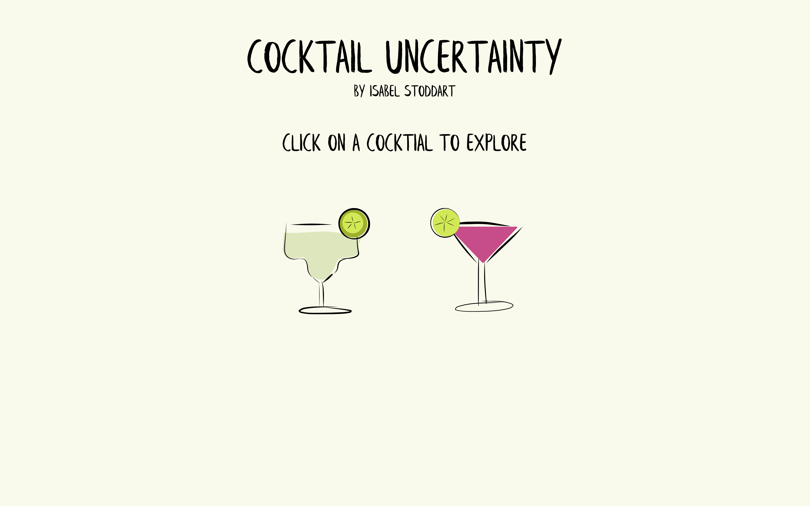

# Cocktail Uncertainty

The purpose of this project was to visualize the many variations in cocktail recipes and the uncertainty around which ingredients are included in a recipe. This project was completed for Data Visualization and Information Aesthetics at Parsons School of Design. 

### Data

The data was taken from 5 online cocktail databases:
* Kindred Cocktails (https://kindredcocktails.com/cocktail)
* The Cocktail DB (https://www.thecocktaildb.com/)
* International Bartenders Association (https://iba-world.com/iba-cocktails/)
* Mixology Recipes (https://www.mixology.recipes/cocktails)
* Awesome Drinks (https://recipe.awesomedrinks.com/)

The finalized dataset is cocktailsData.xlsx

### Iteration 1

My first iteration includes several sketches of what I invisioned the final product looking like. 

I wanted to have a handwritten, journal feel, like someone wrote the cocktail recipes they discovered in a personal cocktail journal. I also wanted to incorporate ingredient proportions in a glass with either a side view of a glass or a view of a glass from above. See the folder inspiration for examples. 

### Iteration 2

My second iteration includes a final sketch mockup with 11 cocktails and pie charts to show where the different ingredients occur within each recipe. There is an envisioned function where a user rolls their mouse over an ingredient in the recipe list and that ingredient is highlighted on each pie chart to show where it is in each individual recipe. 

It also included a rough prototype in Figma that envisions this concept using just the margarita recipes. 

### Iteration 3

