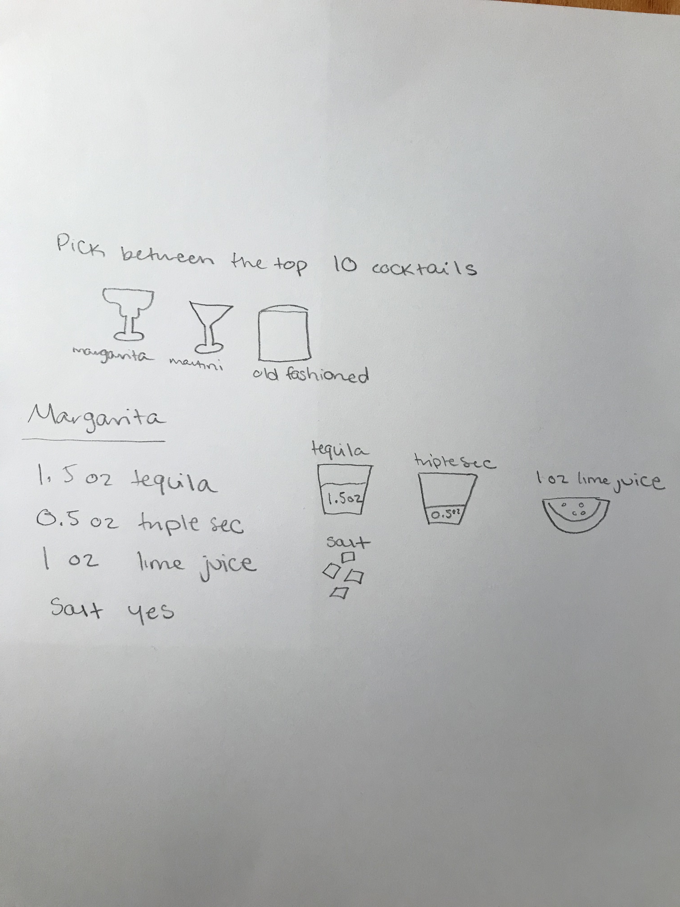
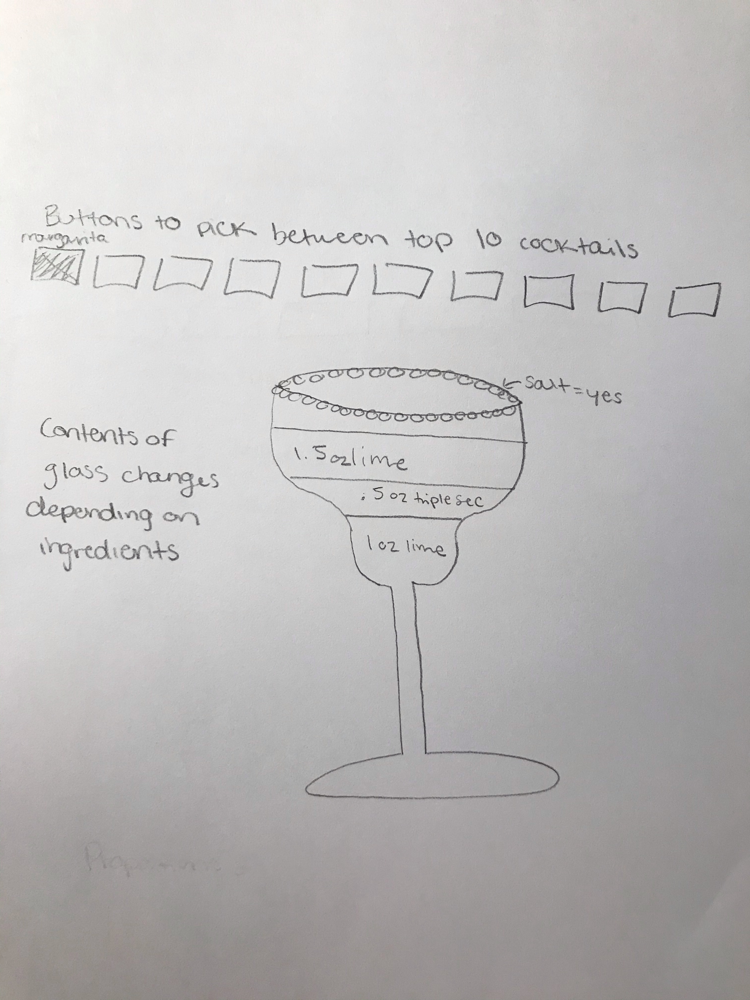
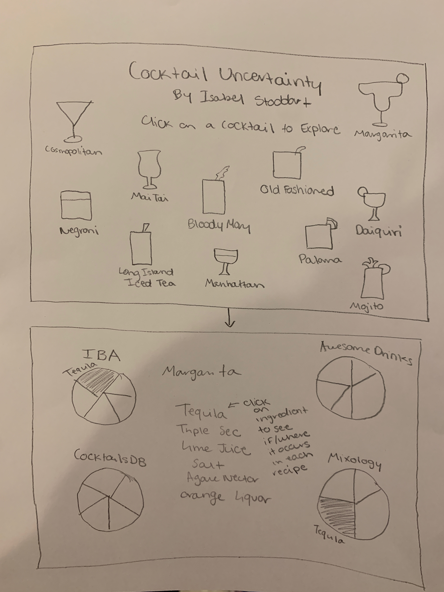
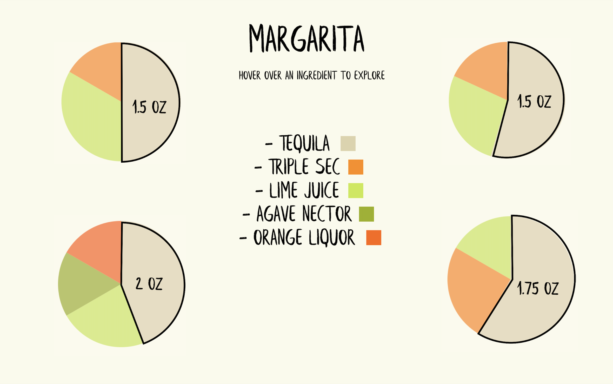
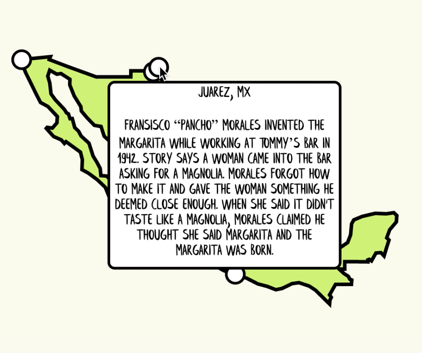
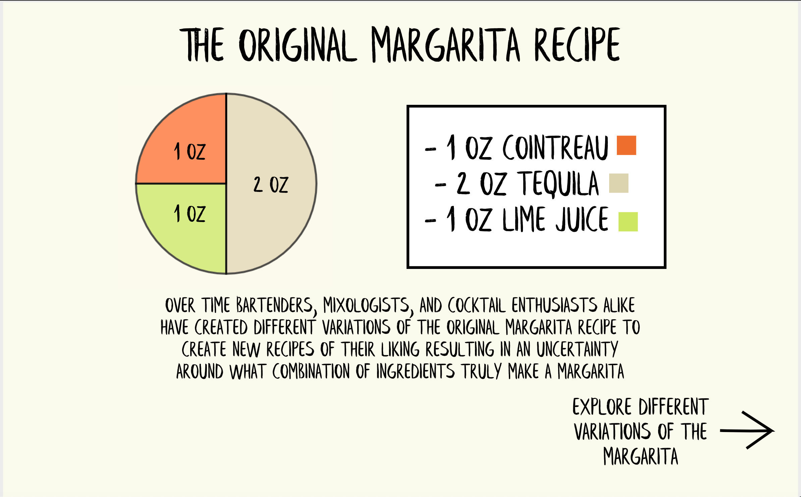

# Cocktail Uncertainty

The purpose of this project was to visualize the many variations in cocktail recipes and the uncertainty around which ingredients are included in a recipe. This project was completed for Data Visualization and Information Aesthetics at Parsons School of Design. 

### Data

The data was taken from 5 online cocktail databases:
* Kindred Cocktails (https://kindredcocktails.com/cocktail)
* The Cocktail DB (https://www.thecocktaildb.com/)
* International Bartenders Association (https://iba-world.com/iba-cocktails/)
* Mixology Recipes (https://www.mixology.recipes/cocktails)
* Awesome Drinks (https://recipe.awesomedrinks.com/)

The finalized dataset is cocktailsData.xlsx

## Iterations

### Project Proposal

My project proposal includes several sketches of what I invisioned the final product looking like. 

I wanted to have a handwritten, journal feel, like someone wrote the cocktail recipes they discovered in a personal cocktail journal. I also wanted to incorporate ingredient proportions in a glass with either a side view of a glass or a view of a glass from above. See the inspiration folder for examples. 

### Iteration 1

My first iteration includes a final sketch mockup with 11 cocktails and pie charts to show where the different ingredients occur within each recipe. There is an envisioned function where a user rolls their mouse over an ingredient in the recipe list and that ingredient is highlighted on each pie chart to show where it is in each individual recipe. 

It also includes a rough prototype in Figma that envisions this concept using just the margarita recipes. 

### Iteration 2

My second iteration includes a map that visualizes the uncertainty around who invented the margarita. I wanted to add more of a story to my visualization so I thought this would be a nice addition. 

It also includes a page with the original margarita recipe. This page is used to tie together the uncertainty behind who created the margarita with the uncertainty around the modern variations of the margarita. 

### Final Prototype

My final prototype cleaned up my past iteration by combining the original margarita recipe page and the pie chart page to create one page with all of the pie charts. I also thought a lot about user experience for this iteration and made the project easier to navigate by adding buttons to each page that make it easier to get to all of the other pages.

The full Figma prototype can be found at: https://www.figma.com/proto/asKmhJ9uaATB3ffDKu10iE/CocktailUncertaintyProto?node-id=1%3A2&scaling=min-zoom

## Final Product

My final product turns my final prototype into code. For my final product I added

